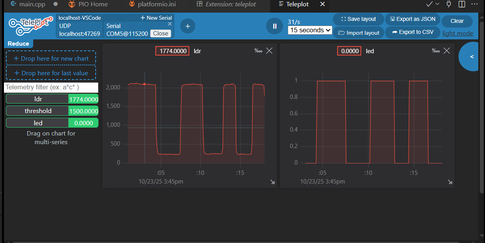

# Dự án Đèn LED tự động bằng cảm biến ánh sáng (ESP32)

Đây là dự án đơn giản sử dụng ESP32, đọc giá trị từ cảm biến LDR (quang trở) để điều khiển một đèn LED.

- **LED:** GPIO 27
- **LDR:** GPIO 34

Khi trời tối (giá trị LDR dưới ngưỡng), đèn LED sẽ tự động bật.

## Đồ thị kết quả (Plot bằng Teleplot)

Dưới đây là ảnh chụp màn hình đồ thị khi che/mở cảm biến LDR:

